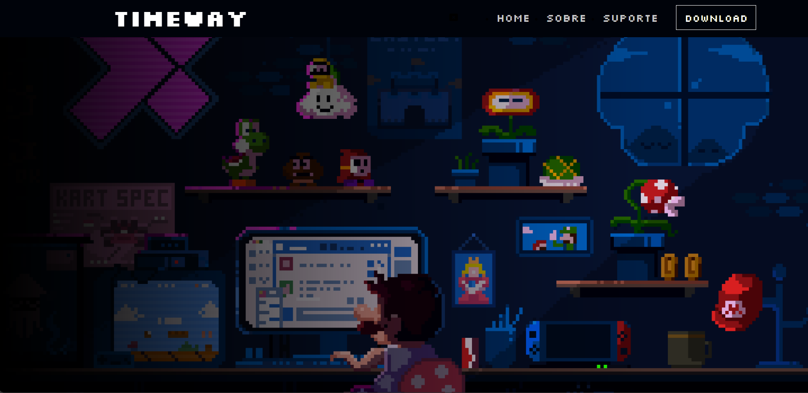
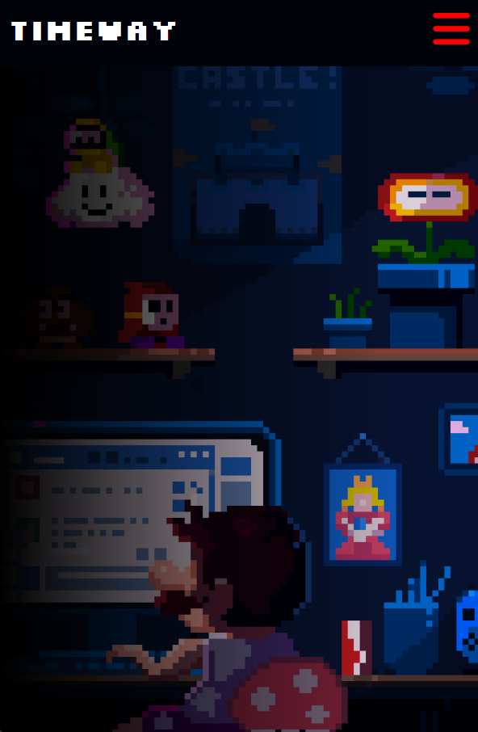

# Timeway

Explicação

> [!NOTE] Esse site foi desenvolvido com o objetivo de ser um instalador de um futuro jogo que estamos criando.

**Timeway** é um jogo que se passa em eras distintas e que vai avançando com o tempo. O jogo ainda está em desenvolvimento, mas tem previsão de sair até fevereiro.

## Preview
- Desktop

- Mobile

## LICENCE
Esse projeto está sob a [MIT LICENCE](./LICENSE.txt).